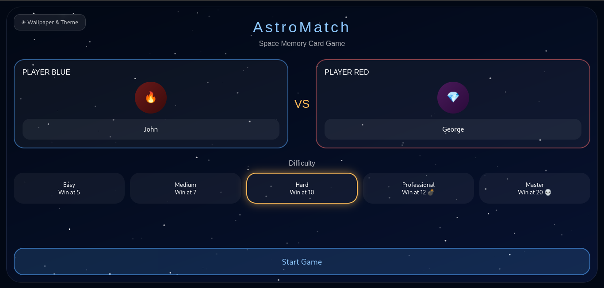
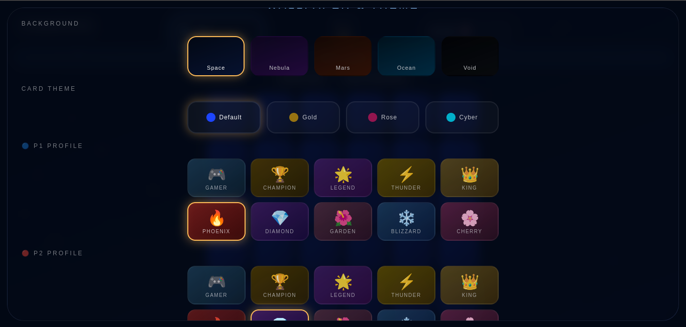
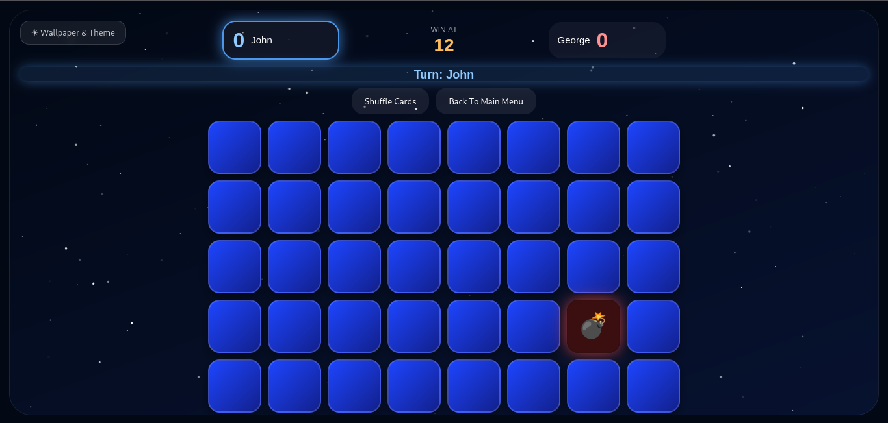

# 🌌 AstroMatch

<p align="center">
  <b>Space Memory Card Game</b>
</p>

<p align="center">
  A stylish local multiplayer memory game focused on reflexes, concentration, and strategic thinking.
</p>

---

## 🎮 About The Game

AstroMatch is a space-themed memory card game built using pure HTML, CSS, and JavaScript.

The game combines:
- Fast thinking
- Memory training
- Reflex speed
- Competitive local multiplayer gameplay

Players compete on the same device while customising themes, wallpapers, profiles, and difficulty settings in a cinematic sci-fi atmosphere.

---

## ✨ Features

|       Feature          |                  Details                                 |
|------------------------|----------------------------------------------------------|
| 🌌 Space theme         | Animated starfield with shooting stars                   |
| 👥 2-Player local      | Blue vs Red on the same device                           |
| 🎚️ 5 difficulty levels | Easy → Medium → Hard → Professional → Master             |
| 💣 Special cards       | Bombs penalise the flipper; Rockets attack the opponent  |
| 🎨 Wallpaper & Theme   | Customise backgrounds, card themes, and player profiles  |
| 🔊 Sound effects       | Synthesised via Web Audio API — no external audio files  |
| 🚀 Rocket animation    | Cinematic rocket flies from card to opponent's score     |
| 🧠 Smart shuffle       | Algorithm guarantees matching pairs are never adjacent   |

---

## 📸 Screenshots

### Main Menu



### Wallpaper & Theme System



### Gameplay



---

## 📂 Project Structure

```bash
AstroMatch/
│
├── index.html          ← Complete game (HTML + CSS + JS, single file)
├── README.md
├── LICENSE.md
├── install.sh          ← Linux desktop installer (registers app, icons, and launcher entry)
├── uninstall.sh        ← Clean removal script
│
├── assets/
│   ├── icons/          ← App icons (16px → 1024px + favicon)
│   ├── images/         ← Screenshots used in README
│   └── sounds/         ← Reserved for future audio assets (sounds are synthesised at runtime)
```

## 🕹️ Difficulty Levels

| Mode         | Goal      | Special Cards                      |
|---------------|------------|------------------------------------|
| Easy          | Win at 5   | 1 Bomb 💣 + 1 Rocket 🚀            |
| Medium        | Win at 7   | 2 Bombs 💣 + 2 Rockets 🚀          |
| Hard          | Win at 10  | 3 Bombs 💣 + 3 Rockets 🚀          |
| Professional  | Win at 12  | ~7% Bombs 💣 + ~4% Rockets 🚀      |
| Master        | Win at 20  | ~10% Bombs 💣 + ~4% Rockets 🚀 ☠️ |

## 🧠 Gameplay Mechanics

AstroMatch is not just about luck.

Players must:
- Memorise card positions
- React quickly
- Predict opponent moves
- Use special cards strategically
- Stay focused under pressure

> **Turn rule:** A successful match lets you flip again immediately — your turn continues until you miss.

### ⚡ Special Card Rules

| Card   | Effect                                                        |
|--------|---------------------------------------------------------------|
| 💣 Bomb   | **Penalises the flipper** — lose 2 points (min 0)          |
| 🚀 Rocket | **Attacks the opponent** — they lose 1 point (min 0)       |

> Special cards are single-use: they trigger once and are removed from the board.

### 💀 Master Mode Penalty
In Master mode, **every wrong pair costs 1 point** — no safe guessing.

The game is designed to improve:
- Memory
- Concentration
- Observation
- Reflexes
- Pattern recognition

---

## 🛠️ Built With

- HTML5
- CSS3
- Vanilla JavaScript
- Web Audio API (synthesised — no external audio files required)

---
## Note

AstroMatch is officially supported on Linux systems.

Windows users can still run the game normally by downloading the source code and opening `index.html` in a web browser.

---
## 🚀 How To Run

### Option A — Browser (any OS)
```bash
# Just double-click index.html
# Or open it in your browser directly
```

### Option B — Linux Desktop App (Debian / Ubuntu / Fedora / Arch)
```bash
chmod +x install.sh
./install.sh
```
Installs AstroMatch as a proper desktop application:
- Copies files to `~/.local/share/AstroMatch/`
- Registers icons at all standard resolutions (16 → 1024 px)
- Creates a `.desktop` entry so the game appears in your application launcher with its icon

> Requires `xdg-open` (pre-installed on all major desktop Linux distros).  
> Uses `rsync` when available, otherwise falls back to `cp`.

To uninstall:
```bash
chmod +x uninstall.sh
./uninstall.sh
```

### Option C — GitHub Pages (live online demo)
Enable GitHub Pages in your repository settings (`Settings → Pages → Deploy from branch → main`) and share the link — the game runs entirely in the browser with no server needed.

---

## 📄 License

Custom License © [abdomukhtar](https://github.com/abdomukhtar)

- ✅ Personal use is free and unrestricted.
- ✅ Sharing and embedding allowed with attribution.
- ⚠️ Commercial use requires prior permission from the author.
- ❌ Modifying and redistributing outside GitHub is not permitted.

See the [LICENSE](LICENSE.md) file for full details.

---

### Friendly conversations, feedback, and collaboration are always welcome.                  
### I would be happy to connect with developers from different countries and learn together. 
